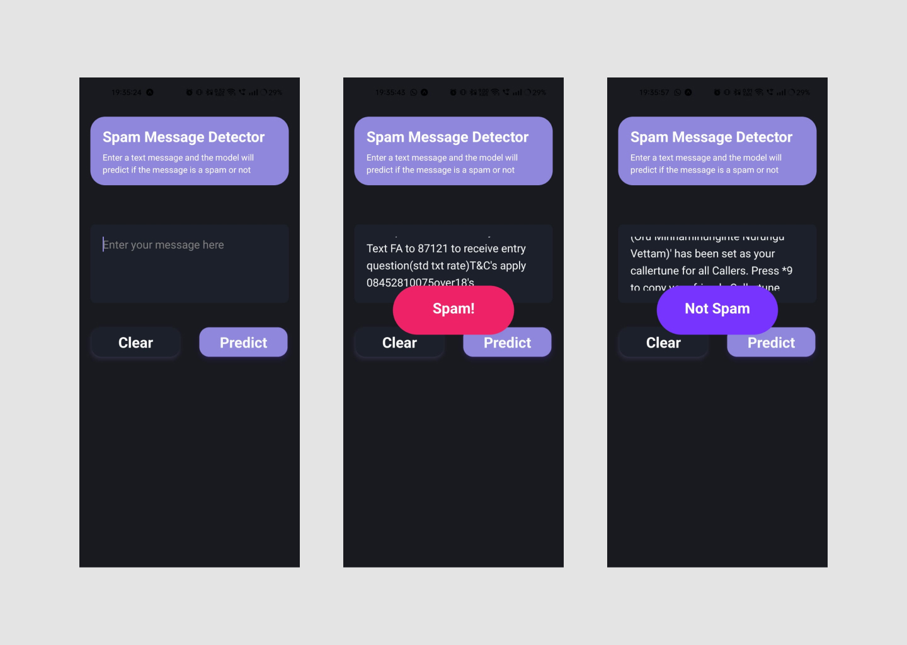

# Message Spam Detector API in Python with React Native Frontend

This project consists of a message spam detector model built using NLTK and scikit-learn in Python. The classifier model is exposed through a Flask API to interact with the model. Additionally, a React Native frontend application is developed to send requests to the Python API, receive predictions, and display the classification results.

## Project Components

### Python Backend

- **Libraries Used (For Model building):**
  - NLTK
  - scikit-learn
  - NumPy
  - Pandas
- **Library Used (For API building):**
  - Flask
- **Library Used (For Database):**
  - Pymongo

- **Message Spam Classifier Model:**
  - The model is trained on a dataset containing labeled messages as spam or ham.
  - Data preprocessing, feature extraction, model training, and evaluation are performed using NLTK and scikit-learn.

- **Flask API:**
  - The Flask API exposes endpoints to receive messages and return predictions from the spam classifier model.

### React Native Frontend

- **Libraries Used:**
  - React Native
  - Native Wind

- **User Interface:**
  - The React Native app provides a user-friendly interface for users to input messages.
  - When a message is entered, the app sends a request to the Python API to classify the message as spam or not.
  - The app then displays the classification result to the user.

## Preview

